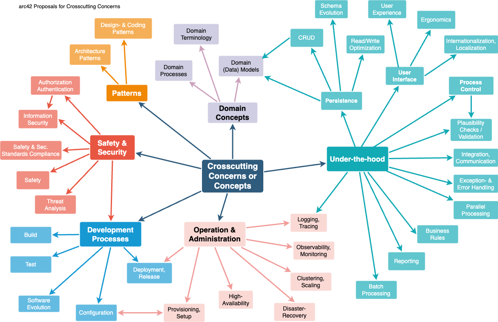

#

**Über arc42**

arc42, das Template zur Dokumentation von Software- und
Systemarchitekturen.

Template Version 9.0-DE. (basiert auf der AsciiDoc Version), Juli 2025

Created, maintained and © by Dr. Peter Hruschka, Dr. Gernot Starke and
contributors. Siehe <https://arc42.org>.

> [!NOTE]
> Diese Version des Templates enthält Hilfen und Erläuterungen. Sie
> dient der Einarbeitung in arc42 sowie dem Verständnis der Konzepte.
> Für die Dokumentation eigener System verwenden Sie besser die _plain_
> Version.

# Einführung und Ziele

<!--

Beschreibt die wesentlichen Anforderungen und treibenden Kräfte, die bei
der Umsetzung der Softwarearchitektur und Entwicklung des Systems
berücksichtigt werden müssen.

Dazu gehören:

- zugrunde liegende Geschäftsziele,

- wesentliche Aufgabenstellungen,

- wesentliche funktionale Anforderungen,

- Qualitätsziele für die Architektur und

- relevante Stakeholder und deren Erwartungshaltung.

-->

DoKoHub ist eine mobile-first Webapp, die es Nutzern erlabut, Runden des Kartenspiels ["Doppelkopf" (wikipeda)](https://de.wikipedia.org/wiki/Doppelkopf) aufzunehmen.

Nutzer erstellen Spiellobbies und laden andere Nutzer ein, um individuelle Punktestände zu vergleichen.
In einer Lobby können mehr als eine Runde Doppelkopf gespielt werden, da Doppelkopf typischerweise in mehreren Runden gespielt wird.
Das erlaubt es, Spielstände über mehrere Spiele hinweg aufzuzeichnen und diverse Statistiken über das Spielverhalten aufzustellen.

> DoKoHub implementiert **NICHT** Doppelkopf selbst, sondern stellt nur Punkteaufzeichnung bereit.

Da Entwicklungsressourcen begrenzt sind und nicht von explosivem Wachstum auszugehen ist, sollte besonders darauf geachtet werden, unnötige Komplexität während der Entwicklung zu vermeiden.

## Aufgabenstellung

<!--

Inhalt

Kurzbeschreibung der fachlichen Aufgabenstellung, treibenden Kräfte,
Extrakt (oder Abstract) der Anforderungen. Verweis auf (hoffentlich
vorliegende) Anforderungsdokumente (mit Versionsbezeichnungen und
Ablageorten).

Motivation

Aus Sicht der späteren Nutzung ist die Unterstützung einer fachlichen
Aufgabe oder Verbesserung der Qualität der eigentliche Beweggrund, ein
neues System zu schaffen oder ein bestehendes zu modifizieren.

Form

Kurze textuelle Beschreibung, eventuell in tabellarischer Use-Case Form.
Sofern vorhanden, sollte die Aufgabenstellung Verweise auf die
entsprechenden Anforderungsdokumente enthalten.

Halten Sie diese Auszüge so knapp wie möglich und wägen Sie Lesbarkeit
und Redundanzfreiheit gegeneinander ab.

Weiterführende Informationen

Siehe [Anforderungen und Ziele](https://docs.arc42.org/section-1/) in
der online-Dokumentation (auf Englisch!).

-->

> Anmerkung zu Anforderungs-IDs:
>
> - Fnn.x: Funktionale Anforderung
> - Qnn.x: Qualitätsanforderung
> - Lnn.x: Rechtliche Anforderung

| ID    | Beschreibung                  | Anmerkungen                                                                                                                                                                                                                 |
| ----- | ----------------------------- | --------------------------------------------------------------------------------------------------------------------------------------------------------------------------------------------------------------------------- |
| F01   | Spielsession-Management       | Spielsessions können erstellt und verwaltet werden                                                                                                                                                                          |
| F01.1 | Andere Spieler einladen       | Ersteller einer Spielsession können andere Nutzer zu dieser einladen                                                                                                                                                        |
| F01.2 | Unerwünschte Nutzer entfernen | Nutzer, die fälschlicherweise einer Session beigetreten sind, können vom Ersteller entfernt werden                                                                                                                          |
| F02   | Spielergebnisse festhalten    | Spielergebnisse können pro Spieler pro Runde verfolgt werden                                                                                                                                                                |
| F02.1 | Spezielle Punkteregeln        | Alle [offiziellen Punkteregln (doko-verband.de)](https://doko-verband.de/regeln-und-ordnungen/) werden unterstützt                                                                                                          |
| F02.2 | Rangliste                     | Während einer Spielsession werden Gesamtpunkte pro Spieler festgehalten                                                                                                                                                     |
| F03   | Spielhistorie                 | Der Nutzer kann seine/ihre Spielergebnisse über Sessions hinweg einsehen und Statistiken aufstellen lassen                                                                                                                  |
| F04   | Gruppen                       | Spieler können Gruppen bilden, um Spielstatistiken in der Gruppe über Sessions hinweg auszuwerten                                                                                                                           |
| F05   | Reproduzierbare Verteilung    | DoKoHub muss einfach auf Servern installierbar sein                                                                                                                                                                         |
| F06   | Mobile-First Webapp           | DoKoHub ist verwendet standartisierte Webtechnologien zur Interaktion und ist für mobile Endgeräte ausgelegt                                                                                                                |
| F07   | Third-Party Anmeldung         | Spieler können sich mittels third-party OAuth-Anbietern anmelden (z.Bsp. Google, Apple etc.)                                                                                                                                |
| L01   | Open-Source Lizenz            | DoKoHub wird unter einer Open-Source Lizenz veröffentlicht                                                                                                                                                                  |
| L02   | Impressum                     | Jeder öffentliche Internetservice muss ein Impressum haben. Siehe [hier (ihk.de)](https://www.ihk.de/chemnitz/recht-und-steuern/rechtsinformationen/internetrecht/pflichtangaben-im-internet-die-impressumspflicht-4401580) |
| L03   | Cookies&Privacy Policy        | Da DoKoHub Nutzerdaten dauerhaft speichert, muss nach DSGVO eine Privacy Policy vorliegen                                                                                                                                   |

## Qualitätsziele

<!--

Inhalt

Die Top-3 bis Top-5 der Qualitätsanforderungen für die Architektur,
deren Erfüllung oder Einhaltung den maßgeblichen Stakeholdern besonders
wichtig sind. Gemeint sind hier wirklich Qualitätsziele, die nicht
unbedingt mit den Zielen des Projekts übereinstimmen. Beachten Sie den
Unterschied.

Hier ein Überblick möglicher Themen (basierend auf dem ISO 25010
Standard):

<figure>

</figure>

Motivation

Weil Qualitätsziele grundlegende Architekturentscheidungen oft
maßgeblich beeinflussen, sollten Sie die für Ihre Stakeholder relevanten
Qualitätsziele kennen, möglichst konkret und operationalisierbar.

Form

Tabellarische Darstellung der Qualitätsziele mit möglichst konkreten
Szenarien, geordnet nach Prioritäten.

-->

Diese Qualitätsziele basieren auf [ISO 25010 (arc42.org, englisch)](https://quality.arc42.org/articles/iso-25010-update-2023).

| ID  | Qualitätsziel            | Beschreibung                                              | Anmerkungen                                                                                                                        |
| --- | ------------------------ | --------------------------------------------------------- | ---------------------------------------------------------------------------------------------------------------------------------- |
| Q01 | Benutzungsfreundlichkeit | System ist einfach verständlich und attraktiv für Nutzer  | Es wird [Accessibility Standards (w3c.org, englisch)](https://www.w3.org/WAI/fundamentals/) und modernen UX Best Practices gefolgt |
| Q02 | Wartbarkeit              | System kann modifiziert und angepasst werden              | DoKoHub wird hauptsächlich von Studierenden entwickelt                                                                             |
| Q03 | Übertragbarkeit          | System kann auf verschiedene Umgebungen übertragen werden | DoKoHub muss auf einer Vielzahl von mobilen Endgeräten lauffähig sein                                                              |

## Stakeholder

<!--

Inhalt

Expliziter Überblick über die Stakeholder des Systems – über alle
Personen, Rollen oder Organisationen –, die

- die Architektur kennen sollten oder

- von der Architektur überzeugt werden müssen,

- mit der Architektur oder dem Code arbeiten (z.B. Schnittstellen
  nutzen),

- die Dokumentation der Architektur für ihre eigene Arbeit benötigen,

- Entscheidungen über das System und dessen Entwicklung treffen.

Motivation

Sie sollten die Projektbeteiligten und -betroffenen kennen, sonst
erleben Sie später im Entwicklungsprozess Überraschungen. Diese
Stakeholder bestimmen unter anderem Umfang und Detaillierungsgrad der
von Ihnen zu leistenden Arbeit und Ergebnisse.

Form

Tabelle mit Rollen- oder Personennamen, sowie deren Erwartungshaltung
bezüglich der Architektur und deren Dokumentation.

-->

| Rolle                         | Kontakt                                                                                       | Erwartungshaltung                                                                                                      |
| ----------------------------- | --------------------------------------------------------------------------------------------- | ---------------------------------------------------------------------------------------------------------------------- |
| Betreuende                    | `le.brauner@ostfalia.de`                                                                      | [Funktionale Anforderungen](#aufgabenstellung) sind erfüllt und klar dokumentiert; Häufige Rückmeldung der Entwickler. |
| Entwickler                    | _siehe [github repo (github.com)](https://github.com/DoKoHub/DoKoHub)_                        | Klar definierte Anforderungen; Konstantes Feedback von anderen Stakeholdern; Aktuelle Dokumentation                    |
| Verteilungsbeauftrage         | -                                                                                             | Klar definierte Verteilungsprozesse; Reproduzierbare Softwarebundles; Überwachungsmöglichkeiten                        |
| Endnutzer                     | -                                                                                             | [Funktionale Anforderungen](#aufgabenstellung) sind erfüllt; Intuitive Nutzerschnittstelle und flüssiges Appverhalten  |
| Externe/Zukünftige Entwickler | Klare, aktuelle Dokumentation; Quick-Start-Anleitung und reproduzierbare Entwicklungsumgebung |                                                                                                                        |
| Externe App-Frontends         | -                                                                                             | Klar dokumentierte, standartisierte Schnittstelle zum Backend                                                          |

# Randbedingungen

<!--

Inhalt

Randbedingungen und Vorgaben, die ihre Freiheiten bezüglich Entwurf,
Implementierung oder Ihres Entwicklungsprozesses einschränken. Diese
Randbedingungen gelten manchmal organisations- oder firmenweit über die
Grenzen einzelner Systeme hinweg.

Motivation

Für eine tragfähige Architektur sollten Sie genau wissen, wo Ihre
Freiheitsgrade bezüglich der Entwurfsentscheidungen liegen und wo Sie
Randbedingungen beachten müssen. Sie können Randbedingungen vielleicht
noch verhandeln, zunächst sind sie aber da.

Form

Einfache Tabellen der Randbedingungen mit Erläuterungen. Bei Bedarf
unterscheiden Sie technische, organisatorische und politische
Randbedingungen oder übergreifende Konventionen (beispielsweise
Programmier- oder Versionierungsrichtlinien, Dokumentations- oder
Namenskonvention).

Weiterführende Informationen

Siehe [Randbedingungen](https://docs.arc42.org/section-2/) in der
online-Dokumentation (auf Englisch!).

-->

| ID  | Beschreibung                              | Anmerkungen                                                                                                                                              |
| --- | ----------------------------------------- | -------------------------------------------------------------------------------------------------------------------------------------------------------- |
| C01 | Primär von Studierenden entwickelt        | Architektur und Code müssen so simpel wie möglich gehalten werden. Komplexe Anforderungen müssen vereinfacht werden.                                     |
| C02 | Kein Budget für Kostenpflichtige Services | DoKoHub muss auf quelloffener Software aufbauen und im Fall von Cloud-Hosting innerhalb der kostenfreien Grenzen bleiben                                 |
| C03 | Platformunabhängig                        | Sowohl Front- als auch Backend müssen mit Plattformunabhängigen Technologien aufgebaut sein. Siehe [Q03](#qualit%C3%A4tsziele), [F06](#aufgabenstellung) |

# Kontextabgrenzung

<!--

Inhalt

Die Kontextabgrenzung grenzt das System gegen alle Kommunikationspartner
(Nachbarsysteme und Benutzerrollen) ab. Sie legt damit die externen
Schnittstellen fest und zeigt damit auch die Verantwortlichkeit (scope)
Ihres Systems: Welche Verantwortung trägt das System und welche
Verantwortung übernehmen die Nachbarsysteme?

Differenzieren Sie fachlichen (Ein- und Ausgaben) und technischen
Kontext (Kanäle, Protokolle, Hardware), falls nötig.

Motivation

Die fachlichen und technischen Schnittstellen zur Kommunikation gehören
zu den kritischsten Aspekten eines Systems. Stellen Sie sicher, dass Sie
diese komplett verstanden haben.

Form

Verschiedene Optionen:

- Diverse Kontextdiagramme

- Listen von Kommunikationsbeziehungen mit deren Schnittstellen

Weiterführende Informationen

Siehe [Kontextabgrenzung](https://docs.arc42.org/section-3/) in der
online-Dokumentation (auf Englisch!).

-->

## Fachlicher Kontext

<!--

Inhalt

Festlegung **aller** Kommunikationsbeziehungen (Nutzer, IT-Systeme, …​)
mit Erklärung der fachlichen Ein- und Ausgabedaten oder Schnittstellen.
Zusätzlich (bei Bedarf) fachliche Datenformate oder Protokolle der
Kommunikation mit den Nachbarsystemen.

Motivation

Alle Beteiligten müssen verstehen, welche fachlichen Informationen mit
der Umwelt ausgetauscht werden.

Form

Alle Diagrammarten, die das System als Blackbox darstellen und die
fachlichen Schnittstellen zu den Nachbarsystemen beschreiben.

Alternativ oder ergänzend können Sie eine Tabelle verwenden. Der Titel
gibt den Namen Ihres Systems wieder; die drei Spalten sind:
Kommunikationsbeziehung, Eingabe, Ausgabe.

**\<Diagramm und/oder Tabelle>**

**\<optional: Erläuterung der externen fachlichen Schnittstellen>**
-->

> TODO(Laila): Hier Übersicht über die unten genannten Kommunikationspartner. Siehe [UML Kontextdiagram (wikipedia.org)](https://de.wikipedia.org/wiki/Kontextdiagramm)

| Kommunikationsbeziehung           | Eingabe (X -> DoKoHub)                                             | Ausgabe (DoKoHub -> X)                    |
| --------------------------------- | ------------------------------------------------------------------ | ----------------------------------------- |
| Client (z.Bsp. Gerät des Nutzers) | Sessions erstellen,managen; Punkte eintragen; Ergebnisse anfordern | Ergebnisse anzeigen                       |
| OAuth-Anbieter                    | Anmelde-Token                                                      | Login-Informationen (Cookie, token, o.ä.) |

## Technischer Kontext

<!--

Inhalt

Technische Schnittstellen (Kanäle, Übertragungsmedien) zwischen dem
System und seiner Umwelt. Zusätzlich eine Erklärung (*mapping*), welche
fachlichen Ein- und Ausgaben über welche technischen Kanäle fließen.

Motivation

Viele Stakeholder treffen Architekturentscheidungen auf Basis der
technischen Schnittstellen des Systems zu seinem Kontext.

Insbesondere bei der Entwicklung von Infrastruktur oder Hardware sind
diese technischen Schnittstellen durchaus entscheidend.

Form

Beispielsweise UML Deployment-Diagramme mit den Kanälen zu
Nachbarsystemen, begleitet von einer Tabelle, die Kanäle auf
Ein-/Ausgaben abbildet.

**\<Diagramm oder Tabelle>**

**\<optional: Erläuterung der externen technischen Schnittstellen>**

**\<Mapping fachliche auf technische Schnittstellen>**
-->

> TODO(laila): Hier Diagramm, das die Kommunikationskanäle zwischen den Partnern zeigt. Siehe [Verteilungsdiagram (wikipedia.de)](https://de.wikipedia.org/wiki/Verteilungsdiagramm)

| Kanal             | Partner        | Ein- / Ausgaben                  | Anmerkungen                 |
| ----------------- | -------------- | -------------------------------- | --------------------------- |
| REST-API          | Client         | Spieler Interaktion / Ergebnisse | -                           |
| HTTP              | Client         | Webseite / Umleitungen           | -                           |
| Authentifizierung | OAuth-Anbieter | Login-Informationen              | Abhängig von OAuth-Anbieter |

# Lösungsstrategie

<!--

Inhalt

Kurzer Überblick über die grundlegenden Entscheidungen und
Lösungsansätze, die Entwurf und Implementierung des Systems prägen.
Hierzu gehören:

- Technologieentscheidungen

- Entscheidungen über die Top-Level-Zerlegung des Systems,
  beispielsweise die Verwendung gesamthaft prägender Entwurfs- oder
  Architekturmuster,

- Entscheidungen zur Erreichung der wichtigsten Qualitätsanforderungen
  sowie

- relevante organisatorische Entscheidungen, beispielsweise für
  bestimmte Entwicklungsprozesse oder Delegation bestimmter Aufgaben an
  andere Stakeholder.

Motivation

Diese wichtigen Entscheidungen bilden wesentliche „Eckpfeiler“ der
Architektur. Von ihnen hängen viele weitere Entscheidungen oder
Implementierungsregeln ab.

Form

Fassen Sie die zentralen Entwurfsentscheidungen **kurz** zusammen.
Motivieren Sie, ausgehend von Aufgabenstellung, Qualitätszielen und
Randbedingungen, was Sie entschieden haben und warum Sie so entschieden
haben. Vermeiden Sie redundante Beschreibungen und verweisen Sie eher
auf weitere Ausführungen in Folgeabschnitten.

Weiterführende Informationen

Siehe [Lösungsstrategie](https://docs.arc42.org/section-4/) in der
online-Dokumentation (auf Englisch!).

-->

Um F06 und Q03 zu erfüllen, ist DoKoHub in [TypeScript (typescriptlang.org, englisch)](https://www.typescriptlang.org/)
mit dem Framework [SvelteKit (svelte.dev, englisch)](https://svelte.dev) geschrieben.
Als Datenbank verwenden wir [PostgresQL (postgresql.org, englisch)](https://www.postgresql.org/)
und [Drizzle (drizzle.team, englisch)](https://orm.drizzle.team/) als
Object-Relational-Mapping.
Deployments werden per Docker geregelt, um F05 zu erfüllen.

DoKoHub ist in Front- und Backend aufgeteilt, um Q02 zu erfüllen und
da es die Standardaufteilung für moderne Webapps ist.

Die Authentifkation der Spieler wird mithilfe von [OAuth2 (oauth.net,englisch)](https://oauth.net/) geregelt.
Das entspricht F07.

Das Frontend kommuniziert mit dem Backend über eine [REST-API (wikipedia.org, englisch)](https://en.wikipedia.org/wiki/REST).
REST ist eine weit verbreitete und bekannte API-Technologie, was third-party Clients zulässt und die strikte Trennung von Front- und Backend einhält.

Zur Reproduzierbarkeit der Entwicklungsumgebung werden Docker Dev-Container eingesetzt.
Ebenfalls wird eine CI-Pipeline basierend auf Docker aufgesetzt.

L01 entsprechend wird das Projekt unter der MIT-Lizenz auf [Github (github.com)](https://github.com/DoKoHub/DoKoHub) gehostet und ist öffentlich einsehbar.

# Bausteinsicht

> TODO: Architektur weiter dokumentieren!

<!--

Inhalt

Die Bausteinsicht zeigt die statische Zerlegung des Systems in Bausteine
(Module, Komponenten, Subsysteme, Klassen, Schnittstellen, Pakete,
Bibliotheken, Frameworks, Schichten, Partitionen, Tiers, Funktionen,
Makros, Operationen, Datenstrukturen, …​) sowie deren Abhängigkeiten
(Beziehungen, Assoziationen, …​)

Diese Sicht sollte in jeder Architekturdokumentation vorhanden sein. In
der Analogie zum Hausbau bildet die Bausteinsicht den *Grundrissplan*.

Motivation

Behalten Sie den Überblick über den Quellcode, indem Sie die statische
Struktur des Systems durch Abstraktion verständlich machen.

Damit ermöglichen Sie Kommunikation auf abstrakterer Ebene, ohne zu
viele Implementierungsdetails offenlegen zu müssen.

Form

Die Bausteinsicht ist eine hierarchische Sammlung von Blackboxen und
Whiteboxen (siehe Abbildung unten) und deren Beschreibungen.

<figure>

</figure>

**Ebene 1** ist die Whitebox-Beschreibung des Gesamtsystems, zusammen
mit Blackbox-Beschreibungen der darin enthaltenen Bausteine.

**Ebene 2** zoomt in einige Bausteine der Ebene 1 hinein. Sie enthält
somit die Whitebox-Beschreibungen ausgewählter Bausteine der Ebene 1,
jeweils zusammen mit Blackbox-Beschreibungen darin enthaltener
Bausteine.

**Ebene 3** zoomt in einige Bausteine der Ebene 2 hinein, usw.

Weiterführende Informationen

Siehe [Bausteinsicht](https://docs.arc42.org/section-5/) in der
online-Dokumentation (auf Englisch!).

-->

## Whitebox Gesamtsystem

<!--

An dieser Stelle beschreiben Sie die Zerlegung des Gesamtsystems anhand
des nachfolgenden Whitebox-Templates. Dieses enthält:

- Ein Übersichtsdiagramm

- die Begründung dieser Zerlegung

- Blackbox-Beschreibungen der hier enthaltenen Bausteine. Dafür haben
  Sie verschiedene Optionen:

  - in *einer* Tabelle, gibt einen kurzen und pragmatischen Überblick
    über die enthaltenen Bausteine sowie deren Schnittstellen.

  - als Liste von Blackbox-Beschreibungen der Bausteine, gemäß dem
    Blackbox-Template (siehe unten). Diese Liste können Sie, je nach
    Werkzeug, etwa in Form von Unterkapiteln (Text), Unter-Seiten (Wiki)
    oder geschachtelten Elementen (Modellierungswerkzeug) darstellen.

- (optional:) wichtige Schnittstellen, die nicht bereits im
  Blackbox-Template eines der Bausteine erläutert werden, aber für das
  Verständnis der Whitebox von zentraler Bedeutung sind. Aufgrund der
  vielfältigen Möglichkeiten oder Ausprägungen von Schnittstellen geben
  wir hierzu kein weiteres Template vor. Im schlimmsten Fall müssen Sie
  Syntax, Semantik, Protokolle, Fehlerverhalten, Restriktionen,
  Versionen, Qualitätseigenschaften, notwendige Kompatibilitäten und
  vieles mehr spezifizieren oder beschreiben. Im besten Fall kommen Sie
  mit Beispielen oder einfachen Signaturen zurecht.

-->

**_\<Übersichtsdiagramm>_**

<!--

Begründung\
*\<Erläuternder Text>*

Enthaltene Bausteine\
*\<Beschreibung der enthaltenen Bausteine (Blackboxen)>*

Wichtige Schnittstellen\
*\<Beschreibung wichtiger Schnittstellen>*

Hier folgen jetzt Erläuterungen zu Blackboxen der Ebene 1.

Falls Sie die tabellarische Beschreibung wählen, so werden Blackboxen
darin nur mit Name und Verantwortung nach folgendem Muster beschrieben:

| **Name**        | **Verantwortung** |
| --------------- | ----------------- |
| *\<Blackbox 1>* | *\<Text>*         |
| *\<Blackbox 2>* | *\<Text>*         |

Falls Sie die ausführliche Liste von Blackbox-Beschreibungen wählen,
beschreiben Sie jede wichtige Blackbox in einem eigenen
Blackbox-Template. Dessen Überschrift ist jeweils der Namen dieser
Blackbox.

-->

### \<Name Blackbox 1>

<!--

Beschreiben Sie die \<Blackbox 1> anhand des folgenden
Blackbox-Templates:

- Zweck/Verantwortung

- Schnittstelle(n), sofern diese nicht als eigenständige Beschreibungen
  herausgezogen sind. Hierzu gehören eventuell auch Qualitäts- und
  Leistungsmerkmale dieser Schnittstelle.

- (Optional) Qualitäts-/Leistungsmerkmale der Blackbox, beispielsweise
  Verfügbarkeit, Laufzeitverhalten o. Ä.

- (Optional) Ablageort/Datei(en)

- (Optional) Erfüllte Anforderungen, falls Sie Traceability zu
  Anforderungen benötigen.

- (Optional) Offene Punkte/Probleme/Risiken

*\<Zweck/Verantwortung>*

*\<Schnittstelle(n)>*

*\<(Optional) Qualitäts-/Leistungsmerkmale>*

*\<(Optional) Ablageort/Datei(en)>*

*\<(Optional) Erfüllte Anforderungen>*

*\<(optional) Offene Punkte/Probleme/Risiken>*
-->

### Backend

Das Backend ist umgesetzt als REST API und ist umgesetzt mit Typescipt

#### REST Schnittstelle

Warum REST? 
Svelte bietet an Front und Backend innerhalb der gleichen Ordnerstruktur umzusetzen und die Erstellung einer REST Schnittstelle bietet sich daher perfekt an. Zudem ist REST ein weitverbreiteter Standard mit gutem tooling support.

#### Endpoints

Die Daten die das Backend annimmt und sendet sind im Format wie in der `types.ts` Datei beschrieben.

##### api/player

> `GET`: 
> URL Parameter: 
> `Keine` 
> Request Body: `Leer` 
> Response Body: `[{Player}]`

Gibt die Liste aller existierenden Spieler zurück.

> `POST`: 
> URL Parameter: 
> `Keine` 
> Request Body: `{"name": string}` 
> Response Body: `{"message": string, "player": Player}`

Erstellt einen neuen Spieler.

##### api/player/[player]

> `GET`: 
> URL Parameter: 
> `[player]`: `UUID` 
> Request Body: `Leer` 
> Response Body: `{Player}`

Gibt einen spezifischen Spieler zurück.

> `PUT`: 
> URL Parameter: 
> `[player]`: `UUID` 
> Request Body: `{"name": string}` 
> Response Body: `{"message": string, "player": Player}`

Bearbeitet den Namen eines Spielers.

> `DELETE`: 
> URL Parameter: 
> `[player]`: `UUID` 
> Request Body: `Leer` 
> Response Body: `{"message": string, "player": Player}`

Löscht einen Spieler.

##### api/player/[player]/identity

> `GET`: 
> URL Parameter: 
> `[player]`: `UUID` 
> Request Body: `Leer` 
> Response Body: `{PlayerIdentity}`

Gibt die Spieleridentität eines Spielers zurück.

> `PUT`: 
> URL Parameter: 
> `[player]`: `UUID` 
> Request Body: `{"playerIdentity": PlayerIdentity}` 
> Response Body: `{"message": string, "playerIdentity": PlayerIdentity}`

Bearbeitet eine Spieleridentität.

> `DELETE`: 
> URL Parameter: 
> `[player]`: `UUID` 
> Request Body: `Leer` 
> Response Body: `{"message": string, "playerIdentity": PlayerIdentity}`

Löscht eine Spieleridentität.

##### api/player/[player]/register

> `POST`: 
> URL Parameter: 
> `[player]`: `UUID` 
> Request Body: `{"playerIdentity": PlayerIdentity}` 
> Response Body: `{"message": String, "playerIdentity": PlayerIdentity}`

Verknüpft einen Spieler zu einer Spieleridentität.

##### api/group

> `GET`: 
> URL Parameter: 
> `Keine` 
> Request Body: `Leer` 
> Response Body: `[{PlayGroup}]`

Gibt alle existierenden Gruppen zurück.

> `POST`: 
> URL Parameter: 
> `Keine` 
> Request Body: `{"name": string}` 
> Response Body: `{"message": string, "playGroup": PlayGroup}`

Erstellt eine neue Gruppe.

##### api/group/[group]

> `GET`: 
> URL Parameter: 
> `[group]`: `UUID` 
> Request Body: `Leer` 
> Response Body: `{PlayGroup}` 

Gibt eine spezifische Gruppe zurück.

> `PUT`: 
> URL Parameter: 
> `[group]`: `UUID` 
> Request Body: `{"playGroup": PlayGroup}` 
> Response Body: `{"message": string, "playGroup": PlayGroup}` 

Bearbeitet eine Gruppe.

> `DELETE`: 
> URL Parameter: 
> `[group]`: `UUID` 
> Request Body: `Leer` 
> Response Body: `{"message": string, "playGroup": PlayGroup}`

Löscht eine Gruppe.

##### api/group/[group]/invite

> `GET`: 
> URL Parameter: 
> `[group]`: `UUID` 
> Request Body: `{"expiresAt": Date, "createdBy": UUID}` 
> Response Body: `{GroupInvite}`

Erstellt eine Einladung zu einer Gruppe.

##### api/group/[group]/member

> `GET`: 
> URL Parameter: 
> `[group]`: `UUID` 
> Request Body: `Leer` 
> Response Body: `[{PlayGroupMember}]` 

Gibt alle Mitglieder einer Gruppe zurück.

> `POST`: 
> URL Parameter: 
> `[group]`: `UUID` 
> Request Body: `{"playerId": UUID, ?"nickname": string}` 
> Response Body: `{"message": string, "playGroupMember": PlayGroupMember}`

Fügt einer Gruppe ein neues Mitglied hinzu.

##### api/group/[group]/member/[member]

> `GET`: 
> URL Parameter: 
> `[group]`: `UUID`  >`[member]`: `UUID` 
> Request Body: `Leer` 
> Response Body: `{PlayGroupMember}` 

Gibt ein spezifisches Mitglied einer Gruppe zurück.

> `PUT`: 
> URL Parameter:  >`[group]`: `UUID`  >`[member]`: `UUID` 
> Request Body: `{"playGroupMember": PlayGroupMember}` 
> Response Body: `{"message": string, "playGroupMember": PlayGroupMember}` 

Bearbeitet ein Mitglied einer Gruppe.

> `DELETE`: 
> URL Parameter:  >`[group]`: `UUID`  >`[member]`: `UUID` 
> Request Body: `Leer` 
> Response Body: `{"message": string, "playGroupMember": PlayGroupMember}`

Setzt den Status eines Mitgliedes einer Gruppe auf `"LEFT"`.

##### api/group/join/[token]

> `POST`: 
> URL Parameter: 
> `[token]`: `string` 
> Request Body: `{"playerId": UUID, ?"nickname": string}` 
> Response Body: `{"message": string, "playGroupMember": PlayGroupMember}` 

Ein Spieler wird über ein Invite Token zu einer Gruppe als Mitglied hinzugefügt.

### \<Name Blackbox n>

_\<Blackbox-Template>_

### \<Name Schnittstelle 1>

...

### \<Name Schnittstelle m>

## Ebene 2

<!--

Beschreiben Sie den inneren Aufbau (einiger) Bausteine aus Ebene 1 als
Whitebox.

Welche Bausteine Ihres Systems Sie hier beschreiben, müssen Sie selbst
entscheiden. Bitte stellen Sie dabei Relevanz vor Vollständigkeit.
Skizzieren Sie wichtige, überraschende, riskante, komplexe oder
besonders volatile Bausteine. Normale, einfache oder standardisierte
Teile sollten Sie weglassen.

-->

### Whitebox _\<Baustein 1>_

<!--

…​zeigt das Innenleben von *Baustein 1*.

-->

_\<Whitebox-Template>_

### Whitebox _\<Baustein 2>_

_\<Whitebox-Template>_

...

### Whitebox _\<Baustein m>_

_\<Whitebox-Template>_

## Ebene 3

<!--

Beschreiben Sie den inneren Aufbau (einiger) Bausteine aus Ebene 2 als
Whitebox.

Bei tieferen Gliederungen der Architektur kopieren Sie diesen Teil von
arc42 für die weiteren Ebenen.

-->

### Whitebox \<\_Baustein x.1\_>

... zeigt das Innenleben von _Baustein x.1_.

_\<Whitebox-Template>_

### Whitebox \<\_Baustein x.2\_>

_\<Whitebox-Template>_

### Whitebox \<\_Baustein y.1\_>

_\<Whitebox-Template>_

# Laufzeitsicht

<!--

Inhalt

Diese Sicht erklärt konkrete Abläufe und Beziehungen zwischen Bausteinen
in Form von Szenarien aus den folgenden Bereichen:

- Wichtige Abläufe oder *Features*: Wie führen die Bausteine der
  Architektur die wichtigsten Abläufe durch?

- Interaktionen an kritischen externen Schnittstellen: Wie arbeiten
  Bausteine mit Nutzern und Nachbarsystemen zusammen?

- Betrieb und Administration: Inbetriebnahme, Start, Stop.

- Fehler- und Ausnahmeszenarien

Anmerkung: Das Kriterium für die Auswahl der möglichen Szenarien (d.h.
Abläufe) des Systems ist deren Architekturrelevanz. Es geht nicht darum,
möglichst viele Abläufe darzustellen, sondern eine angemessene Auswahl
zu dokumentieren.

Motivation

Sie sollten verstehen, wie (Instanzen von) Bausteine(n) Ihres Systems
ihre jeweiligen Aufgaben erfüllen und zur Laufzeit miteinander
kommunizieren.

Nutzen Sie diese Szenarien in der Dokumentation hauptsächlich für eine
verständlichere Kommunikation mit denjenigen Stakeholdern, die die
statischen Modelle (z.B. Bausteinsicht, Verteilungssicht) weniger
verständlich finden.

Form

Für die Beschreibung von Szenarien gibt es zahlreiche
Ausdrucksmöglichkeiten. Nutzen Sie beispielsweise:

- Nummerierte Schrittfolgen oder Aufzählungen in Umgangssprache

- Aktivitäts- oder Flussdiagramme

- Sequenzdiagramme

- BPMN (Geschäftsprozessmodell und -notation) oder EPKs
  (Ereignis-Prozessketten)

- Zustandsautomaten

- …​

Weiterführende Informationen

Siehe [Laufzeitsicht](https://docs.arc42.org/section-6/) in der
online-Dokumentation (auf Englisch!).

-->

## _\<Bezeichnung Laufzeitszenario 1>_

- \<hier Laufzeitdiagramm oder Ablaufbeschreibung einfügen>

- \<hier Besonderheiten bei dem Zusammenspiel der Bausteine in diesem
  Szenario erläutern>

## _\<Bezeichnung Laufzeitszenario 2>_

…​

## _\<Bezeichnung Laufzeitszenario n>_

…​

# Verteilungssicht

Inhalt

Die Verteilungssicht beschreibt:

1. die technische Infrastruktur, auf der Ihr System ausgeführt wird,
   mit Infrastrukturelementen wie Standorten, Umgebungen, Rechnern,
   Prozessoren, Kanälen und Netztopologien sowie sonstigen
   Bestandteilen, und

1. die Abbildung von (Software-)Bausteinen auf diese Infrastruktur.

Häufig laufen Systeme in unterschiedlichen Umgebungen, beispielsweise
Entwicklung-/Test- oder Produktionsumgebungen. In solchen Fällen sollten
Sie alle relevanten Umgebungen aufzeigen.

Nutzen Sie die Verteilungssicht insbesondere dann, wenn Ihre Software
auf mehr als einem Rechner, Prozessor, Server oder Container abläuft
oder Sie Ihre Hardware sogar selbst konstruieren.

Aus Softwaresicht genügt es, auf die Aspekte zu achten, die für die
Softwareverteilung relevant sind. Insbesondere bei der
Hardwareentwicklung kann es notwendig sein, die Infrastruktur mit
beliebigen Details zu beschreiben.

Motivation

Software läuft nicht ohne Infrastruktur. Diese zugrundeliegende
Infrastruktur beeinflusst Ihr System und/oder querschnittliche
Lösungskonzepte, daher müssen Sie diese Infrastruktur kennen.

Form

Das oberste Verteilungsdiagramm könnte bereits in Ihrem technischen
Kontext enthalten sein, mit Ihrer Infrastruktur als EINE Blackbox. Jetzt
zoomen Sie in diese Infrastruktur mit weiteren Verteilungsdiagrammen
hinein:

- Die UML stellt mit Verteilungsdiagrammen (Deployment diagrams) eine
  Diagrammart zur Verfügung, um diese Sicht auszudrücken. Nutzen Sie
  diese, evtl. auch geschachtelt, wenn Ihre Verteilungsstruktur es
  verlangt.

- Falls Ihre Infrastruktur-Stakeholder andere Diagrammarten bevorzugen,
  die beispielsweise Prozessoren und Kanäle zeigen, sind diese hier
  ebenfalls einsetzbar.

Weiterführende Informationen

Siehe [Verteilungssicht](https://docs.arc42.org/section-7/) in der
online-Dokumentation (auf Englisch!).

## Infrastruktur Ebene 1

An dieser Stelle beschreiben Sie (als Kombination von Diagrammen mit
Tabellen oder Texten):

- die Verteilung des Gesamtsystems auf mehrere Standorte, Umgebungen,
  Rechner, Prozessoren o. Ä., sowie die physischen Verbindungskanäle
  zwischen diesen,

- wichtige Begründungen für diese Verteilungsstruktur,

- Qualitäts- und/oder Leistungsmerkmale dieser Infrastruktur,

- Zuordnung von Softwareartefakten zu Bestandteilen der Infrastruktur

Für mehrere Umgebungen oder alternative Deployments kopieren Sie diesen
Teil von arc42 für alle wichtigen Umgebungen/Varianten.

**_\<Übersichtsdiagramm>_**

Begründung\
_\<Erläuternder Text>_

Qualitäts- und/oder Leistungsmerkmale\
_\<Erläuternder Text>_

Zuordnung von Bausteinen zu Infrastruktur\
_\<Beschreibung der Zuordnung>_

## Infrastruktur Ebene 2

An dieser Stelle können Sie den inneren Aufbau (einiger)
Infrastrukturelemente aus Ebene 1 beschreiben.

Für jedes Infrastrukturelement kopieren Sie die Struktur aus Ebene 1.

### _\<Infrastrukturelement 1>_

_\<Diagramm + Erläuterungen>_

### _\<Infrastrukturelement 2>_

_\<Diagramm + Erläuterungen>_

…​

### _\<Infrastrukturelement n>_

_\<Diagramm + Erläuterungen>_

# Querschnittliche Konzepte

Inhalt

Dieser Abschnitt beschreibt übergreifende, prinzipielle Regelungen und
Lösungsansätze, die an mehreren Stellen (=_querschnittlich_) relevant
sind.

Solche Konzepte betreffen oft mehrere Bausteine. Dazu können vielerlei
Themen gehören, wie beispielsweise die Themen aus dem nachfolgenden
Diagramm:

<figure>

</figure>

Motivation

Konzepte bilden die Grundlage für _konzeptionelle Integrität_
(Konsistenz, Homogenität) der Architektur und damit eine wesentliche
Grundlage für die innere Qualität Ihrer Systeme.

Dieser Abschnitt im Template ist der richtige Ort für die konsistente
Behandlung solcher Themen.

Viele solche Konzepte beeinflussen oder beziehen sich auf mehrerer Ihrer
Bausteine.

Form

Kann vielfältig sein:

- Konzeptpapiere mit beliebiger Gliederung,

- beispielhafte Implementierung speziell für technische Konzepte,

- übergreifende Modelle/Szenarien mit Notationen, die Sie auch in den
  Architektursichten nutzen,

Struktur

Wählen Sie **nur** die wichtigsten Themen für Ihr System und erklären
das jeweilige Konzept dann unter einer Level-2 Überschrift dieser
Sektion (z.B. 8.1, 8.2 etc).

Beschränken Sie sich auf die wichtigen, und versuchen **auf keinen
Fall** alle oben dargestellten Themen zu bearbeiten.

Weiterführende Informationen

Einige Themen innerhalb von Systemen betreffen oft mehrere Bausteine,
Hardwareelemente oder Prozesse. Es könnte einfacher sein, solche
_Querschnittsthemen_ an einer zentralen Stelle zu kommunizieren oder zu
dokumentieren, anstatt sie in der Beschreibung der betreffenden
Bausteine, Hardwareelemente oder Entwicklungsprozesse zu wiederholen.

Bestimmte Konzepte können **alle** Elemente eines Systems betreffen,
andere sind vielleicht nur für einige wenige relevant.

Siehe [Querschnittliche Konzepte](https://docs.arc42.org/section-8/) in
der online-Dokumentation (auf Englisch).

## _\<Konzept 1>_

_\<Erklärung>_

## _\<Konzept 2>_

_\<Erklärung>_

…​

## _\<Konzept n>_

_\<Erklärung>_

# Architekturentscheidungen

Inhalt

Wichtige, teure, große oder riskante Architektur- oder
Entwurfsentscheidungen inklusive der jeweiligen Begründungen. Mit
"Entscheidungen" meinen wir hier die Auswahl einer von mehreren
Alternativen unter vorgegebenen Kriterien.

Wägen Sie ab, inwiefern Sie Entscheidungen hier zentral beschreiben,
oder wo eine lokale Beschreibung (z.B. in der Whitebox-Sicht von
Bausteinen) sinnvoller ist. Vermeiden Sie Redundanz. Verweisen Sie evtl.
auf Abschnitt 4, wo schon grundlegende strategische Entscheidungen
beschrieben wurden.

Motivation

Stakeholder des Systems sollten wichtige Entscheidungen verstehen und
nachvollziehen können.

Form

Verschiedene Möglichkeiten:

- ADR ([Documenting Architecture
  Decisions](https://cognitect.com/blog/2011/11/15/documenting-architecture-decisions))
  für jede wichtige Entscheidung

- Liste oder Tabelle, nach Wichtigkeit und Tragweite der Entscheidungen
  geordnet

- ausführlicher in Form einzelner Unterkapitel je Entscheidung

Weiterführende Informationen

Siehe [Architekturentscheidungen](https://docs.arc42.org/section-9/) in
der arc42 Dokumentation (auf Englisch!). Dort finden Sie Links und
Beispiele zum Thema ADR.

# Qualitätsanforderungen

Inhalt

Dieser Abschnitt enthält alle relevanten Qualitätsanforderungen.

Die wichtigsten davon haben Sie bereits in Abschnitt 1.2
(Qualitätsziele) hervorgehoben, daher soll hier nur auf sie verwiesen
werden. In diesem Abschnitt 10 sollten Sie auch Qualitätsanforderungen
mit geringerer Bedeutung erfassen, deren Nichterfüllung keine großen
Risiken birgt (die aber _nice-to-have_ sein könnten).

Motivation

Weil Qualitätsanforderungen die Architekturentscheidungen oft maßgeblich
beeinflussen, sollten Sie die für Ihre Stakeholder relevanten
Qualitätsanforderungen kennen, möglichst konkret und operationalisiert.

Weiterführende Informationen

- Siehe [Qualitätsanforderungen](https://docs.arc42.org/section-10/) in
  der online-Dokumentation (auf Englisch!).

- Siehe auch das ausführliche [Q42 Qualitätsmodell auf
  https://quality.arc42.org](https://quality.arc42.org).

## Übersicht der Qualitätsanforderungen

Inhalt

Eine Übersicht oder Zusammenfassung der Qualitätsanforderungen.

Motivation

Oft stößt man auf Dutzende (oder sogar Hunderte) von detaillierten
Qualitätsanforderungen für ein System. In diesem Abschnitt sollten Sie
versuchen, sie zusammenzufassen, z. B. durch die Beschreibung von
Kategorien oder Themen (wie z.B. von [ISO
25010:2023](https://www.iso.org/obp/ui/#iso:std:iso-iec:25010:ed-2:v1:en)
oder [Q42](https://quality.arc42.org) vorgeschlagen).

Wenn diese Kurzbeschreibungen oder Zusammenfassungen bereits präzise,
spezifisch und messbar sind, können Sie Abschnitt 10.2 auslassen.

Form

Verwenden Sie eine einfache Tabelle, in der jede Zeile eine Kategorie
oder ein Thema und eine kurze Beschreibung der Qualitätsanforderung
enthält. Alternativ können Sie auch eine Mindmap verwenden, um diese
Qualitätsanforderungen zu strukturieren. In der Literatur (insb.
[Bass+21]) ist die Idee eines _Quality Attribute Utility Tree_ (auf
Deutsch manchmal kurz als _Qualitätsbaum_ bezeichnet) beschrieben
worden, der den Oberbegriff „Qualität“ als Wurzel hat und eine
baumartige Verfeinerung des Begriffs „Qualität“ verwendet.

## Qualitätsszenarien

Inhalt

Qualitätsszenarien konkretisieren Qualitätsanforderungen und ermöglichen
es zu entscheiden, ob sie erfüllt sind (im Sinne von
Akzeptanzkriterien). Stellen Sie sicher, dass Ihre Szenarien spezifisch
und messbar sind.

Zwei Arten von Szenarien finden wir besonders nützlich:

- Nutzungsszenarien (auch bekannt als Anwendungs- oder
  Anwendungsfallszenarien) beschreiben, wie das System zur Laufzeit auf
  einen bestimmten Auslöser reagieren soll. Hierunter fallen auch
  Szenarien zur Beschreibung von Effizienz oder Performance. Beispiel:
  Das System beantwortet eine Benutzeranfrage innerhalb einer Sekunde.

- Änderungsszenarien\_ beschreiben die gewünschte Wirkung einer Änderung
  oder Erweiterung des Systems oder seiner unmittelbaren Umgebung.
  Beispiel: Zusätzliche Funktionalität wird implementiert oder
  Anforderungen an ein Qualitätsmerkmal ändern sich, und der Aufwand
  oder die Dauer der Änderung wird gemessen.

Form

Typische Informationen für detaillierte Szenarien sind die folgenden:

In Kurzform (bevorzugt im Q42-Modell):

- K**ontext/Hintergrund**: Um welche Art von System oder Komponente
  handelt es sich, wie sieht die Umgebung oder Situation aus?

- **Quelle/Stimulus**: Wer oder was initiiert oder löst ein Verhalten,
  eine Reaktion oder eine Aktion aus.

- **Metrik/Akzeptanzkriterien**: Eine Reaktion einschließlich einer
  _Maßnahme_ oder _Metrik_

Die Langform von Szenarien (die von der SEI und [Bass+21] bevorzugt
wird) ist detaillierter und enthält die folgenden Informationen:

- **Szenario-ID**: Ein eindeutiger Bezeichner für das Szenario.

- **Szenario-Name**: Ein kurzer, beschreibender Name für das Szenario.

- **Quelle**: Die Entität (Benutzer, System oder Ereignis), die das
  Szenario auslöst.

- **Stimulus**: Das auslösende Ereignis oder die Bedingung, auf die das
  System reagieren muss.

- **Umgebung**: Der betriebliche Kontext oder die Bedingungen, unter
  denen das System den Stimulus erlebt.

- **Artefakt**: Die Bausteine oder anderen Elemente des Systems, die von
  dem Stimulus betroffen sind.

- **Reaktion**: Das Ergebnis oder Verhalten, das das System als Reaktion
  auf den Stimulus zeigt.

- **Antwortmaß**: Das Kriterium oder die Metrik, nach der die Antwort
  des Systems bewertet wird.

Beispiele

Ausführliche Beispiele für Qualitätsanforderungen finden Sie auf [der
Website zum Qualitätsmodell Q42](https://quality.arc42.org).

Weitere Informationen

- Len Bass, Paul Clements, Rick Kazman: „Software Architecture in
  Practice“, 4. Auflage, Addison-Wesley, 2021.

# Risiken und technische Schulden

Inhalt

Eine nach Prioritäten geordnete Liste der erkannten Architekturrisiken
und/oder technischen Schulden.

Motivation

> Risikomanagement ist Projektmanagement für Erwachsene.
>
> — Tim Lister Atlantic Systems Guild

Unter diesem Motto sollten Sie Architekturrisiken und/oder technische
Schulden gezielt ermitteln, bewerten und Ihren Management-Stakeholdern
(z.B. Projektleitung, Product-Owner) transparent machen.

Form

Liste oder Tabelle von Risiken und/oder technischen Schulden, eventuell
mit vorgeschlagenen Maßnahmen zur Risikovermeidung, Risikominimierung
oder dem Abbau der technischen Schulden.

Weiterführende Informationen

Siehe [Risiken und technische
Schulden](https://docs.arc42.org/section-11/) in der
online-Dokumentation (auf Englisch!).

# Glossar

Inhalt

Die wesentlichen fachlichen und technischen Begriffe, die Stakeholder im
Zusammenhang mit dem System verwenden.

Nutzen Sie das Glossar ebenfalls als Übersetzungsreferenz, falls Sie in
mehrsprachigen Teams arbeiten.

Motivation

Sie sollten relevante Begriffe klar definieren, so dass alle Beteiligten

- diese Begriffe identisch verstehen, und

- vermeiden, mehrere Begriffe für die gleiche Sache zu haben.

Form

Zweispaltige Tabelle mit \<Begriff> und \<Definition>.

Eventuell weitere Spalten mit Übersetzungen, falls notwendig.

Weiterführende Informationen

Siehe [Glossar](https://docs.arc42.org/section-12/) in der
online-Dokumentation (auf Englisch!).

| Begriff        | Definition        |
| -------------- | ----------------- |
| _\<Begriff-1>_ | _\<Definition-1>_ |
| _\<Begriff-2_  | _\<Definition-2>_ |
