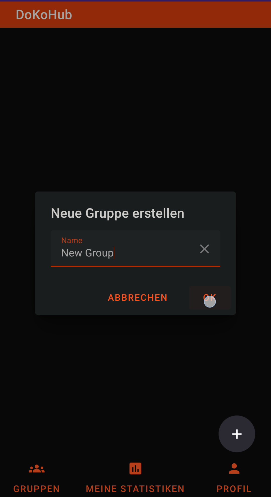
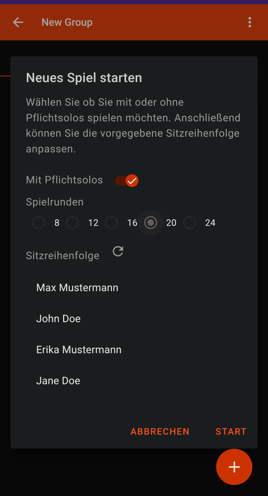
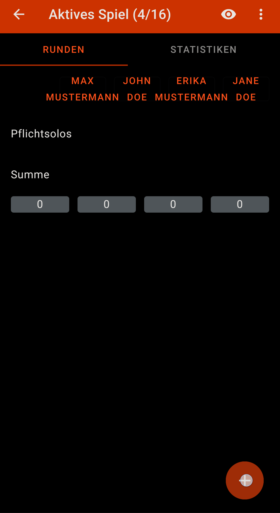
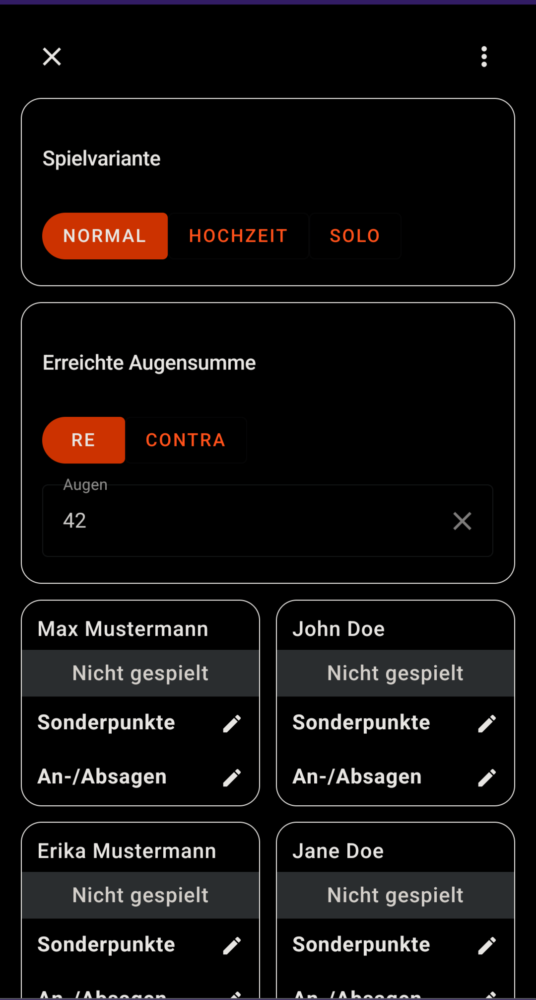
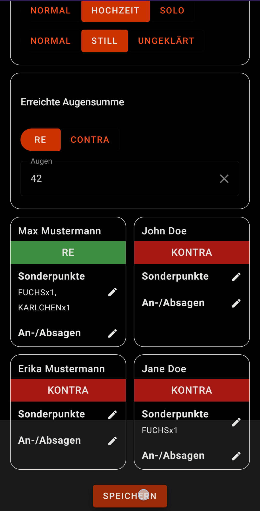

# Benutzungsanleitung DokoHub

> Looking for deployment guide? See [here]()

Diese Anleitung ist für Endnutzer gedacht, um einen Überblick über die Funktionen der App zu geben.
Es wird gezeigt, wie man:

1. sich einloggt
2. eine neue Gruppe anlegt
3. neue Mitglider in der Gruppe hinzufügt
4. Ein neues Spiel startet
5. Eine neue Runde in gestarteten Spiel hinzufügt
6. Als eingeloggter Spieler einer Gruppe beitritt

## Walkthrough für neue Mitglieder

### Einloggen

Ruf die Startseite der App auf. Zum Beispiel `https://doko.veltko.de/`.
Klicke auf das Textfeld "Name\*".

Gib deinen Namen ein und drücke die Enter-Taste.

Nun öffnet sich die Gruppenübersichts-Seite. Hier werden alle Gruppen angezeigt, in denen du Mitglied bist. Klicke in auf den Plus-Botton in der unteren rechten Ecke.

Gib im im Textfeld den Namen der neuen Gruppe an und klicke auf "OK".

Nun öffnet sich die Hauptseite der neu erstellten Gruppe. Mit dem Zurück-Knopf oben link kehrst du auf die Homepage zurück.  
In der Mitte der Seite werden alle Spiele der Gruppe angezeigt, momentan gibt es noch keins.  
Klicke auf "Mitglieder" oben rechts, um ein paar Freunde hinzuzufügen.

Dieser Screen zeigt alle momentanen Mitglieder der Gruppe an. Klicke auf den Plus-Knopf unten rechts.

Gib den Namen des neuen Mitglieds an. Wir fügen insgesamt drei weitere Mitglieder zu, sodass vier Personen in der Gruppe sind.
Für ein echtes Spiel würdest du nun deine Freunde bitten, [der Gruppe beizutreten](#einer-gruppe-beitreten)

Nun sind vier Personen in der Gruppe, klicke oben links auf "Spiele", um zur Spielübersicht zurückzukehren.

Klicke auf den Plus-Button unten rechts, um ein neues Spiel zu starten.

Im Popup kannst du nun die Parameter für das neue Spiel angeben.
Sobald sich das Fenster geschlossen hat, klicke auf das neu erstellte Spiel.

Dieses Fenster zeigt die bisherigen Runden des Spiels und die Punktesummen aller Spieler.
Klicke auf den Plus-Button unten rechts, um die Ergebnisse für eine neue Runde einzutragen.

Diese Seite erlaubt es dir, den Speiltyp auszuwählen, die Gewinnerseite sowie ihre Punkte und pro Spieler Sonderpunkte und An- bzw. Absagen einzutragen.

Nachdem du die Rundenergebnisse eingetragen hast, klicke auf "Speichern" (eventuell musst du dafür runterscrollen).
Du wirst zurück zur Rundenübersicht geleitet und kannst die neue Runde einsehen :)

## Einer Gruppe beitreten

Um einer Gruppe beizutreten, klick auf den Einladungslink, den der Gruppenadmin dir geschickt hat.  
Die folgende Seite öffnet sich:

Wähle einen der vorgeschlagenen Namen vor oder gib einen eigenen Namen ein um unter einem anderen Namen beizutreten.
Wenn du keinen der vorhandenen Namen auswählst und bereits vier Personen in der Gruppe sind, kannst du nicht beitreten!
